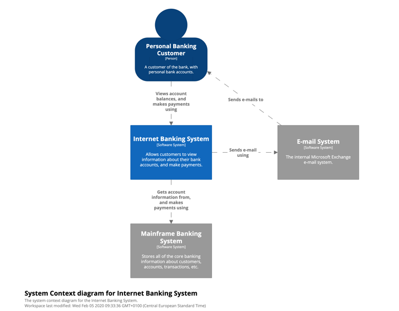
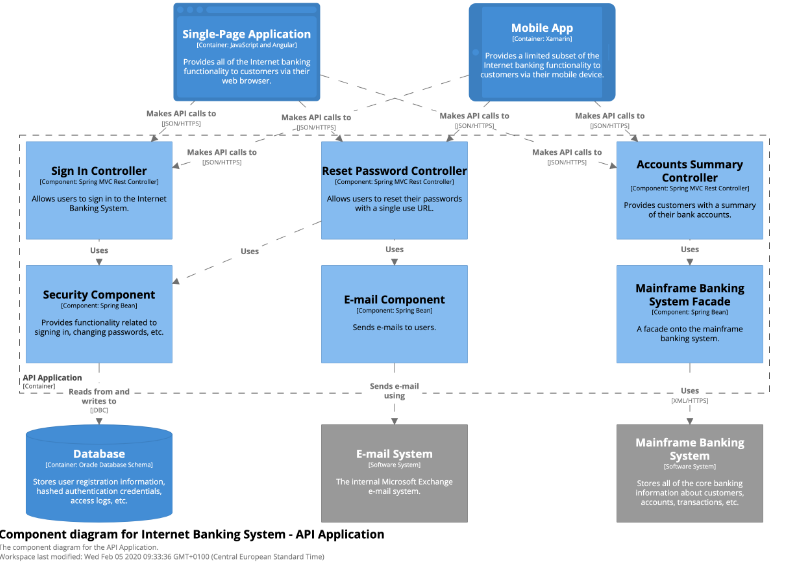
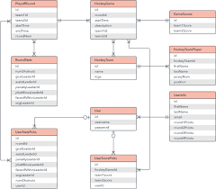

# 3 Modelagem e diagramas arquiteturais: (Modelo C4)
Descrevam brevemente a modelagem da solução apresentando seu diagrama geral com as camadas da arquitetura projetada de forma simples e direta.

Exemplo:

## 3.1 Nível 1: Diagrama de Contexto
Apresente um diagrama mostrando seu sistema como uma caixa no centro cercada por seus usuários e outros sistemas com os quais ele interage. Demonstre uma visão geral da paisagem do sistema.

  

## 3.2 Nível 2: Diagrama de Contêiner
Apresente a forma de alto nível da arquitetura de software e como as responsabilidades são distribuídas por ela. Mostre as principais opções de tecnologia e como os contêineres se comunicam entre si.

  

## 3.3 Nível 3: Diagrama de Componentes
Apresente a composição do contêiner em vários "componentes". O que são cada um desses componentes, suas responsabilidades e os detalhes de tecnologia/implementação.

  

## 3.4 Nível 4: Código
Apresente cada componente para mostrar como ele é implementado como código. Pode-se utilizar um diagrama de classe UML, um diagrama de Entidade/Relacionamentos, tabelas do banco de dados, estrutura de um JSON, estrutura de classes de código, etc.

  

---
